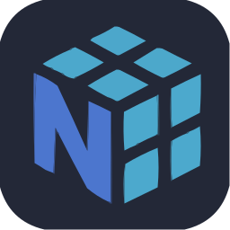

<h1 align="center">
    

  <a href="https://twitter.com/kannanj362">
  
    

 

</h1>

- 📍Based in **India**
- 🎓Pursuing **B.Tech Computer Science Engineering Degreee** (Final year); with specialization in **Artificial Intelligence and Machine learning.** 
- 💻 Currently learning and working on **Machine learning Operations** and **Full stack Data science**. 
- 🏆 [Microsoft Certified Azure Data Scientist Associative](https://www.credly.com/badges/326e81e7-08bd-4059-8029-79bcae461534/public_url) - [Data Engineering and Machine Learning on GCP](https://coursera.org/share/720afb1a2a850ced564f75aab7f1a945)

    
 
 
<h1 align="center" >Technologies & Tools </h1>

&nbsp;&nbsp;&nbsp;&nbsp;<a href="https://github.com/kannanjayachandran">
